# 📦 Real-Time Demand Forecasting & Analytics Dashboard

> A Streamlit-based retail intelligence platform for demand forecasting, consumer behaviour clustering, and real-time prediction — built on 73,100 retail records spanning 5 stores and 20 products (2022–2024).


---

## 🗂️ Table of Contents

- [Overview](#overview)
- [Features](#features)
- [Dashboard Modules](#dashboard-modules)
- [Dataset](#dataset)
- [Tech Stack](#tech-stack)
- [Installation](#installation)
- [Usage](#usage)
- [Project Structure](#project-structure)
- [Model Details](#model-details)
- [Screenshots](#screenshots)
- [Contributing](#contributing)
- [License](#license)

---

## Overview

This project delivers an end-to-end retail analytics solution that combines machine learning with interactive visualization. It was developed during an internship to address three core retail intelligence problems:

1. **Demand Forecasting** — predicting daily units sold using ensemble ML models
2. **Consumer Segmentation** — identifying purchase behaviour clusters via KMeans + PCA
3. **Real-Time Prediction** — an interactive engine for instant, configurable demand forecasts with sensitivity analysis

---

## Features

- 📊 **Dashboard Overview** — KPI summary cards, monthly sales trend, category/regional breakdowns, season-category demand heatmap
- 🔵 **Consumer Clustering** — KMeans segmentation with adjustable K, PCA 2D projection, radar profiles, elbow curve
- 🤖 **Demand Forecasting Models** — side-by-side training and evaluation of 6–8 models (RF, GBM, XGBoost, LightGBM, Ridge, Decision Tree, Voting Ensemble, Stacking Ensemble)
- ⚡ **Real-Time Prediction Engine** — instant demand forecast with price sensitivity curve and discount sensitivity analysis

---

## Dashboard Modules

### 1 — Dashboard Overview
High-level retail KPIs and time series trends. Surfaces seasonal demand patterns and category-level performance at a glance.

| Metric | Value |
|---|---|
| Total Units Sold | 9,975,582 |
| Avg Daily Demand | 136.5 |
| Avg Inventory Level | 274 |
| Avg Price | $55.14 |

### 2 — Consumer Clustering Insights
KMeans clustering on behavioural features (`Units Sold`, `Price`, `Discount`, `Stock Utilization`, etc.) with PCA dimensionality reduction for 2D visualization. Adjustable K from 2–8. Includes:
- Scatter plot of consumer segments
- Per-segment summary (units, price, discount, stock utilization)
- Category and region distribution by segment
- Normalized radar chart of cluster profiles
- Elbow curve for optimal K selection

### 3 — Demand Forecasting Models
Configurable training pipeline with adjustable sample size (5k–50k records). Models evaluated on RMSE, MAE, R², and MAPE. Outputs:
- Ranked model comparison table
- R² score bar chart
- RMSE vs MAE grouped bar chart
- Actual vs Predicted scatter (best model)
- Residual distribution histogram
- Feature importance ranking (top 15)

### 4 — Real-Time Prediction Engine
Pre-trained Voting Ensemble (XGBoost + LightGBM + Random Forest) for instant prediction. Inputs span product, store, and environmental context. Post-prediction outputs:
- Predicted units sold result card
- Demand sensitivity to price (line chart)
- Demand sensitivity to discount (bar chart)
- Normalized input summary chart

---

## Dataset

**File:** `retail_store_inventory.csv`

| Column | Description |
|---|---|
| `Date` | Transaction date (DD-MM-YYYY) |
| `Store ID` | Store identifier (S001–S005) |
| `Product ID` | Product identifier (P0001–P0020) |
| `Category` | Product category (Groceries, Toys, Clothing, Electronics, Furniture) |
| `Region` | Geographic region (North, South, East, West) |
| `Inventory Level` | Units in stock |
| `Units Sold` | Target variable — daily units sold |
| `Units Ordered` | Replenishment order quantity |
| `Demand Forecast` | Legacy forecast value |
| `Price` | Unit selling price ($) |
| `Discount` | Discount percentage (0–50%) |
| `Weather Condition` | Sunny / Rainy / Snowy / Cloudy |
| `Holiday/Promotion` | Binary flag (0/1) |
| `Competitor Pricing` | Competitor's price for same product ($) |
| `Seasonality` | Season (Spring / Summer / Autumn / Winter) |

**Engineered features added at runtime:**
- `Month`, `DayOfWeek`, `Quarter`, `WeekOfYear`
- `PriceDiscounted` = Price × (1 - Discount/100)
- `PriceDiff` = Price - Competitor Pricing
- `StockUtilization` = Units Sold / (Inventory Level + 1)

---

## Tech Stack

| Layer | Libraries |
|---|---|
| App Framework | Streamlit |
| Data Processing | Pandas, NumPy |
| Machine Learning | scikit-learn 1.5.2, XGBoost, LightGBM |
| Visualization | Plotly Express, Plotly Graph Objects |

---

## Installation

**Prerequisites:** Python 3.9+

```bash
# 1. Clone the repository
git clone https://github.com/<your-username>/retail-demand-forecasting.git
cd retail-demand-forecasting

# 2. Create and activate a virtual environment (recommended)
python -m venv venv
source venv/bin/activate        # Linux/macOS
venv\Scripts\activate           # Windows

# 3. Install dependencies
pip install -r requirements.txt

# 4. Run the app
streamlit run app.py
```

The app will open at `http://localhost:8501` by default.

---

## Usage

1. Place `retail_store_inventory.csv` in the same directory as `app.py`
2. Launch the app with `streamlit run app.py`
3. Navigate between modules using the **System Navigation** sidebar
4. On the **Demand Forecasting Models** page, click **Execute Training Pipeline** to train and compare models
5. On the **Real-Time Prediction Engine** page, configure input parameters and click **Generate Forecast**

---

## Project Structure

```
retail-demand-forecasting/
│
├── app.py                        # Main Streamlit application
├── retail_store_inventory.csv    # Dataset (73,100 records)
├── requirements.txt              # Python dependencies
└── README.md                     # This file
```

---

## Model Details

### Prediction Engine (Real-Time)
A **Voting Ensemble** combining three base learners, trained on up to 30,000 records for responsive inference:

| Base Learner | n_estimators |
|---|---|
| XGBoost Regressor | 100 |
| LightGBM Regressor | 100 |
| Random Forest Regressor | 100 |

### Forecasting Pipeline (Model Comparison Page)
Eight models trained with an 80/20 train-test split:

| Model | Type |
|---|---|
| Random Forest | Bagging ensemble |
| Gradient Boosting | Boosting ensemble |
| XGBoost | Gradient boosting |
| LightGBM | Gradient boosting |
| Ridge Regression | Linear (regularized) |
| Decision Tree | Tree-based |
| Voting Ensemble | Soft voting (XGB + LGB + RF) |
| Stacking Ensemble | Meta-learner: Ridge |

**Evaluation metrics:** RMSE, MAE, R², MAPE

---

## Screenshots

### 📊 Dashboard Overview
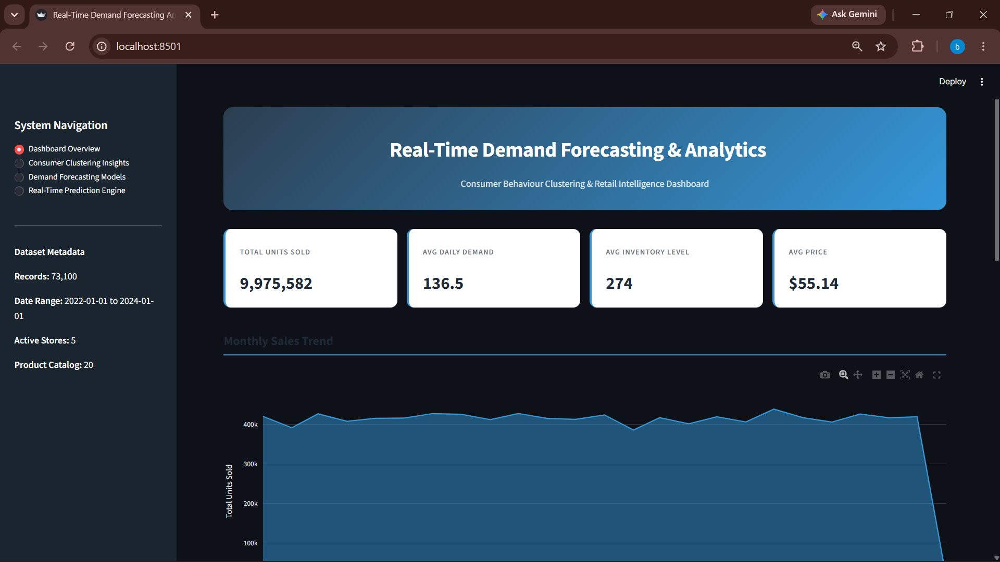
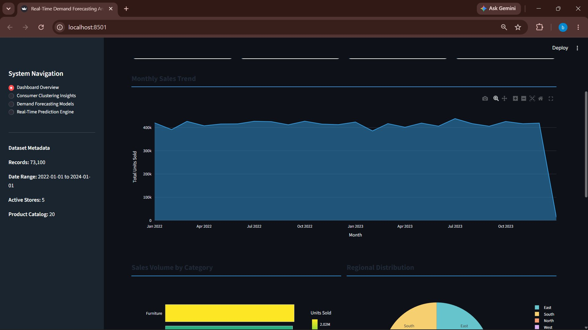
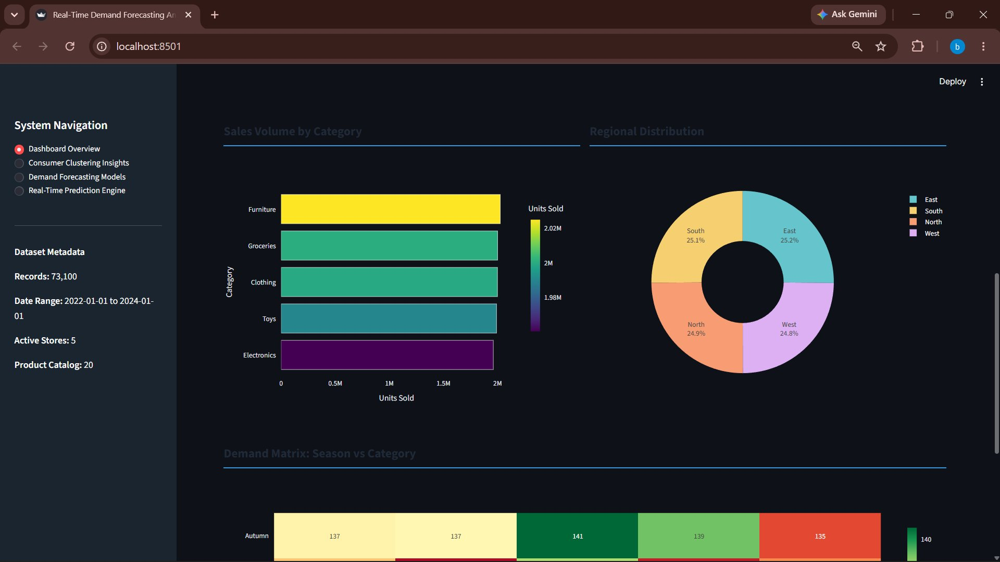
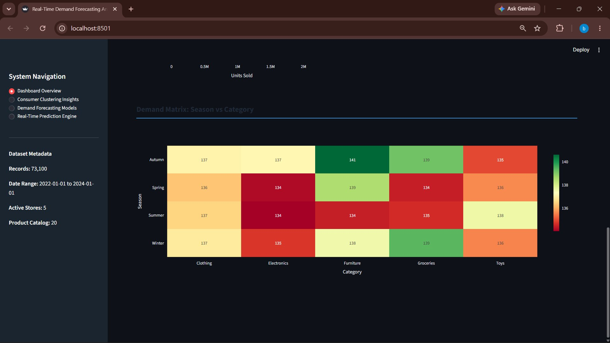

### 🔵 Consumer Clustering Insights
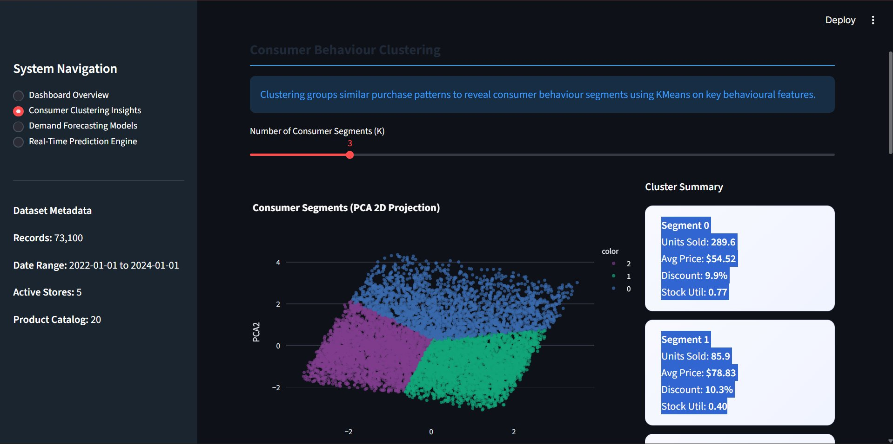
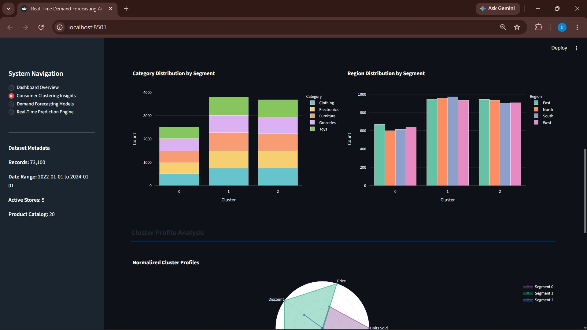
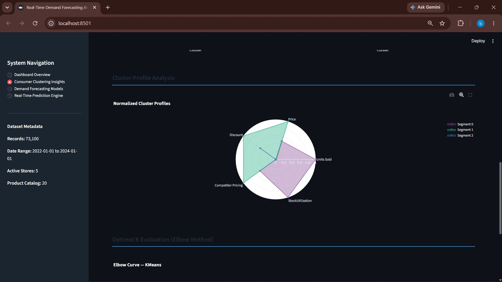
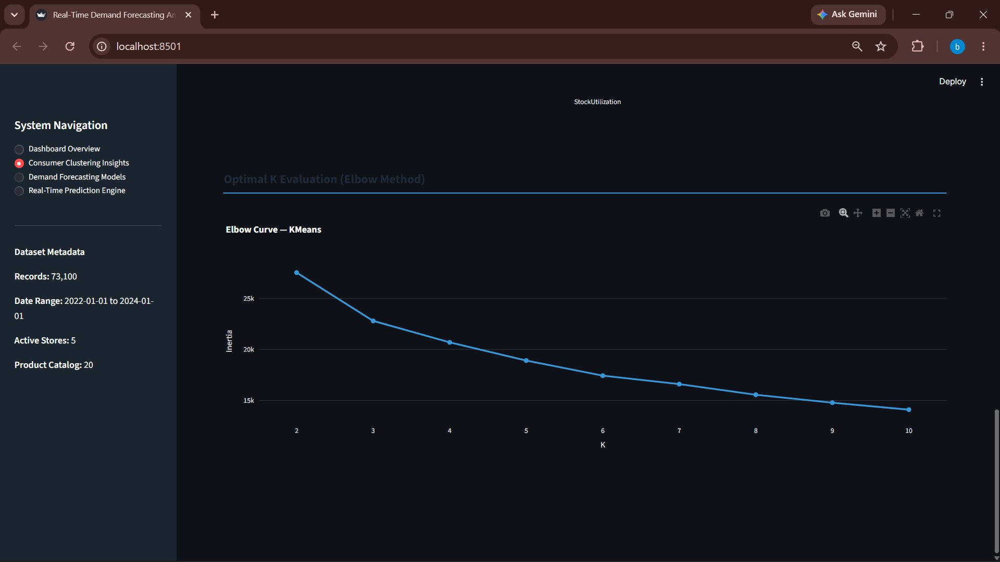

### 🤖 Demand Forecasting Models
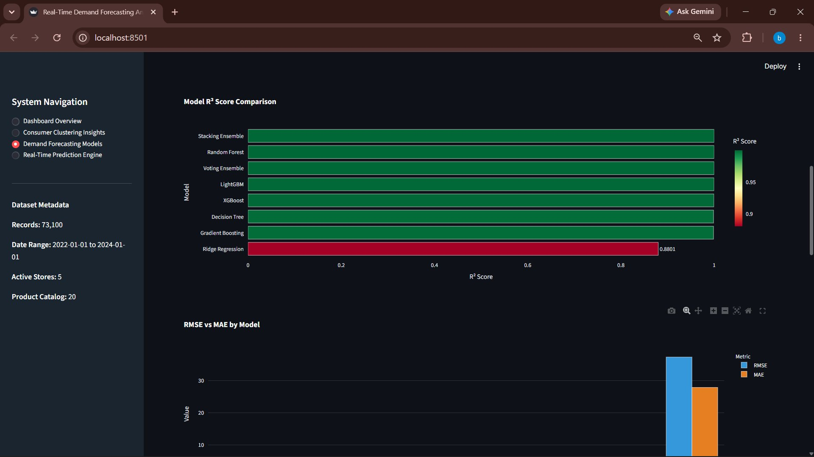
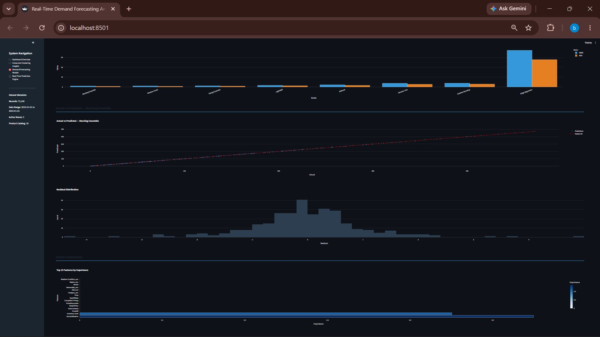

### ⚡ Real-Time Prediction Engine
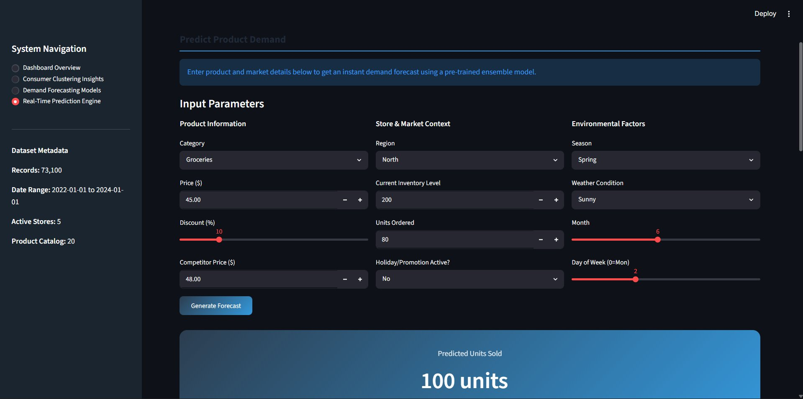
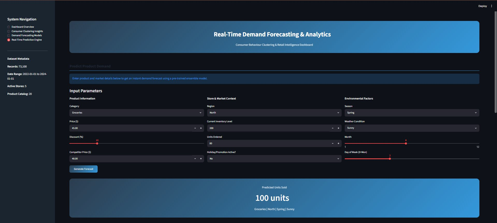
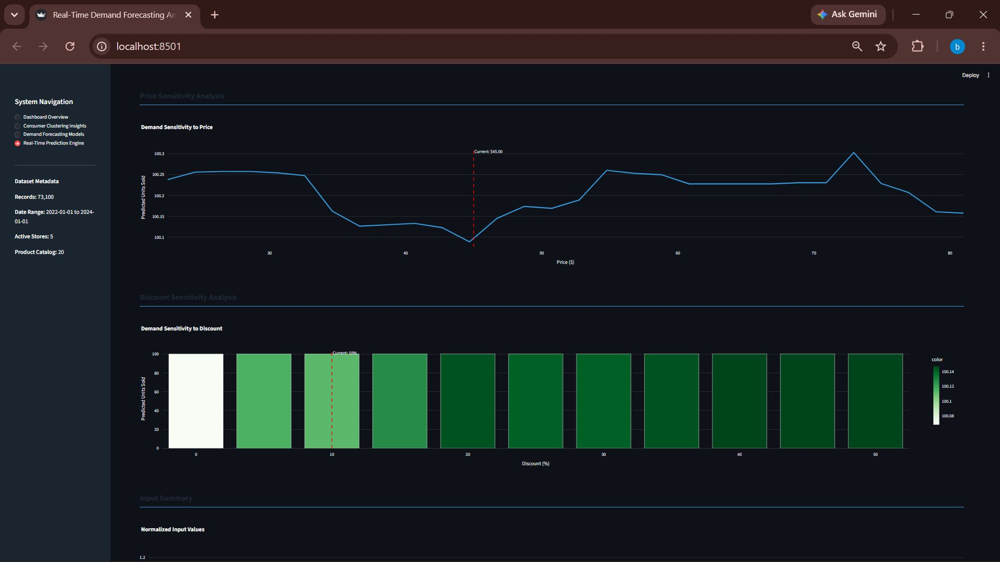

---

## Contributing

Pull requests are welcome. For major changes, please open an issue first to discuss the proposed change.

1. Fork the repository
2. Create a feature branch (`git checkout -b feature/your-feature`)
3. Commit your changes (`git commit -m 'Add your feature'`)
4. Push to the branch (`git push origin feature/your-feature`)
5. Open a Pull Request

---

## License

This project is licensed under the [MIT License](LICENSE).

---

*Built during an internship project — Real-Time Demand Forecasting & Consumer Intelligence for Retail Analytics.*
